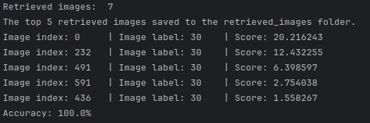
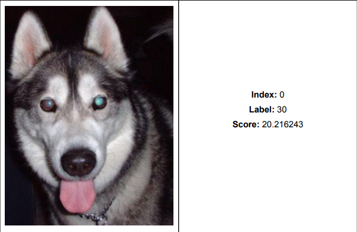
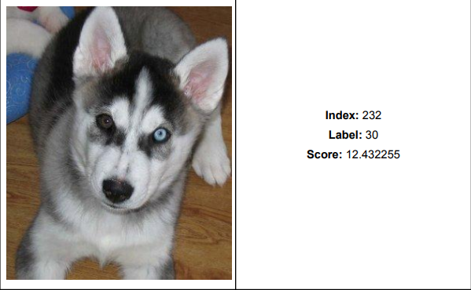
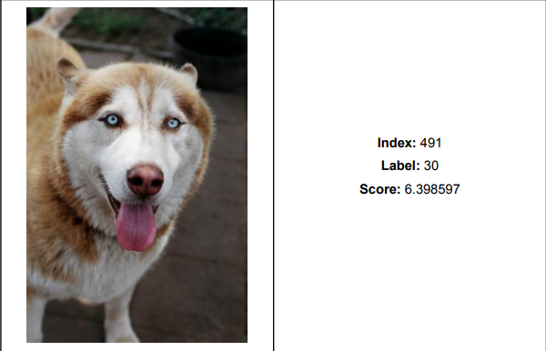
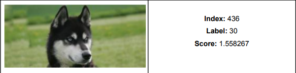

# Image Analysis (2023) - Content-Based Image Retrieval

## Project Overview

This project is a team assignment for the "Image Analysis" course, offered in the 7th semester of the 2023 academic year at the University of Piraeus, Department of Informatics. The project focuses on developing graph-theoretical algorithms for content-based image retrieval, based on the methodology outlined in the paper “[Multimedia Retrieval through Unsupervised Hypergraph-based Manifold Ranking](./docs/IEEE-TIP_2019-AcceptedVersion.pdf)” (IEEE TRANSACTIONS ON IMAGE PROCESSING, VOL. 28, NO. 12, DECEMBER 2019). The project is divided into five main tasks:

1. **Rank Normalization**: Implement a method to normalize ranking sequences, improving the symmetry of the neighborhood sets in the image retrieval process.

2. **Hypergraph Construction**: Build a hypergraph where each hyperedge connects a set of images based on their feature similarity, facilitating the organization and retrieval of images.

3. **Hyperedge Similarity Calculation**: Calculate the similarities between hyperedges, considering both the similarity of the ranked lists and the images referred to by the hyperedges.

4. **Cartesian Product of Hyperedge Elements**: Compute the Cartesian product of hyperedge elements to enhance the relationship between image pairs in the hypergraph.

5. **Hypergraph-Based Similarity Computation**: Use the constructed hypergraph to compute similarities between images, which serves as the basis for retrieving similar images to a given target image.

## Course Information

- **Institution:** University of Piraeus
- **Department:** Department of Informatics
- **Course:** Image Analysis (2023)
- **Semester:** 7th

## Technologies Used

- Python
- **Libraries**: 
  - `torchvision`
  - `networkx`
  - `numpy`
  - `scipy`
  - `matplotlib`

## Project Structure

The repository is structured as follows:

```
/source
    /image_analysis.py                   # Executable
    /images-dataset              
/auxiliary2023                   
    /ImageDatabase                       # Directory containing the input images
    /OutputResults                       # Directory containing output results
/docs
    /Project-description.pdf
    /Project-documentation.pdf
    /IEEE-TIP_2019-AcceptedVersion.pdf   # Scientific paper
```

- **`/source`**: Contains the source code files for the project.
- **`/docs`**: Contains the project's pdfs.

## Usage Example

The script from the `image_analysis.py` will compute the hypergraph-based similarities and output the most similar images from the database for a given target image.

**Original Image:**


**Results:**



**Retrieved Pictures:**








## Setup Instructions

1. **Clone the repository**

3. **Run the script**:

    Follow the usage example to execute the script.

## Contributors

<table>
  <tr>
    <td align="center"><a href="https://github.com/thkox"><br /><sub><b>Theodoros Koxanoglou</b></sub></a><br /></td>
    <td align="center"><a href="https://github.com/ApostolisSiampanis"><br /><sub><b>Apostolis Siampanis</b></sub></a><br /></td>
    <td align="center"><a href="https://github.com/AlexanderCholis"><br /><sub><b>Alexander Cholis</b></sub></a><br /></td>
  </tr>
</table>

## License

This project is licensed under the MIT License - see the [LICENSE](./LICENSE) file for details.
